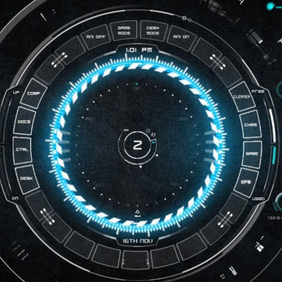

# Chief of Staff (Jarvis)

A local, voice-activated desktop **command center** for talking to your AI
agents. It listens (speech recognition), thinks (your local CLI agents /
a file-bridge to **Amazon Quick**), and speaks back (neural voices) — all
wrapped in a sci-fi HUD. Runs on your machine; nothing is deployed.

> Persona: "Jarvis, your Chief of Staff." Rename freely — see Configuration.

**Compatible with macOS and desktop OS (Windows / Linux).** macOS gets the
premium native voice path; Windows and Linux run the same HUD and features with
a Web Speech fallback. See [Compatibility](#compatibility) and
[`docs/packaging-desktop.md`](docs/packaging-desktop.md).



## Features

- **Voice in/out** — speech recognition + natural spoken replies. Auto-submits
  after a short pause; a Stop button cuts playback mid-sentence.
- **Sci-fi HUD** — animated center dial that reacts to the voice, a neon
  light-grid background, a live clock, a transcript sidebar, and agent "rings"
  that light up on hand-off.
- **Agent routing** — map spoken phrases to your agents:
  - C-suite advisors: **Chief Financial Officer**, **Chief Security Officer**,
    and a **PM Agent**.
  - A **UX Design Shop** launcher (Open Design integration).
  - An **AI Developer** that drives a local coding CLI agent.
  - A **Daily Summary** briefing via Amazon Quick.
- **Amazon Quick bridge** — a JSON file mailbox so Amazon Quick can answer voice
  requests (finance reports, daily briefings, calendar, email, and more) and
  cache results for instant reads. See
  [`docs/quick-setup.md`](docs/quick-setup.md) and
  [`docs/voice-bridge-spec.md`](docs/voice-bridge-spec.md).

> **Roles included in this build:** Chief Financial Officer, UX Design Shop,
> PM Agent, Chief Security Officer, Daily Summary.
> **Intentionally excluded:** the **Chief Growth Officer** and **Marketing &
> Sales** roles are not shown in the UI and are not routed.

## Prerequisites

Download and install these before setting up the app:

1. **Kiro IDE** — the agentic IDE that powers the AI Developer and the C-suite
   agents (and the AWS Security Agent Power used by the CSO).
   Download: <https://kiro.dev/downloads> · Docs: <https://kiro.dev/docs>
2. **Amazon Quick** — required for the file-bridge features (CFO finance
   reports, Daily Report, calendar, email, bookings, system status). Amazon
   Quick connects to your email/calendar/integrations and writes answers back to
   the bridge. Download / get started: <https://quick.amazon.com> (Amazon Quick
   Suite). Bridge setup: [`docs/quick-setup.md`](docs/quick-setup.md).
3. **Node.js 18+** and **npm** — to install, run, and package the app.
4. **A local agent CLI** (optional) — for the AI Developer / advisor features
   (`KIRO_CLI`, see Configuration).
5. **Open Design (bundled)** — the **UX Design Shop** is powered by Open Design,
   which ships with this app as a **git submodule** at `third_party/open-design`.
   Building it requires **Node 24** and **pnpm** (`corepack enable` provides
   pnpm). It's a one-time setup — see [Open Design (bundled)](#open-design-bundled).
   Customers do **not** need a separate Open Design install.

Platform-specific extras:

- **macOS:** **Xcode command line tools** to compile the tiny Swift speech
  helper (`xcode-select --install`), and optionally a premium `say` voice
  (System Settings → Accessibility → Spoken Content).
- **Windows / Linux:** no native speech toolchain required — voice falls back to
  the browser Web Speech API (see [Compatibility](#compatibility)).
- **`uv` / `uvx`** (optional) — only if you enable the **AWS Security Agent**
  Kiro Power for the CSO. Install: <https://docs.astral.sh/uv/getting-started/installation/>.

## Quick start (macOS)

```bash
# Clone WITH the Open Design submodule (or run the submodule step below)
git clone --recurse-submodules <this-repo-url>

npm install

# Build the native speech helper (one time, macOS only)
swiftc -O -o native/coco-speech native/coco-speech.swift

# Build the bundled Open Design (one time — for the UX Design Shop)
./scripts/setup-open-design.sh

npm start          # launch in dev
```

Already cloned without submodules? Pull it in:

```bash
git submodule update --init --recursive
./scripts/setup-open-design.sh
```

On first launch, allow **Microphone** and **Speech Recognition** when macOS
prompts. Tap the mic (or say the wake word) and speak.

### Windows / Linux

```bash
npm install
npm start
```

No Swift helper is needed; the app uses the Web Speech fallback (see below).

## Packaging (Mac / Windows / Linux)

Package a distributable app with electron-builder:

```bash
npm run dist       # macOS: .app + .dmg into dist/
```

Windows (`.exe`) and Linux (`AppImage`/`deb`) targets, signing/notarization, and
a CI build matrix are documented in
[`docs/packaging-desktop.md`](docs/packaging-desktop.md).

## Compatibility

| Capability | macOS | Windows / Linux |
|------------|-------|------------------|
| HUD, transcript, typing box | ✅ | ✅ |
| Text-to-speech | ✅ native `say` (premium voices) | ✅ Web Speech (installed system voices) |
| Speech-to-text | ✅ native on-device `SFSpeechRecognizer` | ⚠️ Web Speech (unreliable in Electron — use the typing box or add an OS STT helper) |
| Amazon Quick file-bridge | ✅ | ✅ |
| Kiro agents (CFO, PM, CSO, AI Developer) | ✅ | ✅ (set `KIRO_CLI` to an absolute path) |
| UX Design Shop (Open Design) | ✅ | ✅ |

The native macOS calls are guarded in `electron-main.js`; off macOS the renderer
(`app.js`) automatically uses the Web Speech API. Details and per-OS build steps
are in [`docs/packaging-desktop.md`](docs/packaging-desktop.md).

## Configuration

All config is via environment variables (see `.env.example`) — no personal
paths are hardcoded.

| Var | Purpose | Default |
|-----|---------|---------|
| `COS_BRIDGE_ROOT` | Amazon Quick file-bridge folder | `~/Documents/CoS-Bridge` |
| `COS_SAY_VOICE` | macOS voice for replies (macOS only) | `Ava (Premium)` |
| `KIRO_CLI` | Path to your agent CLI | `~/.local/bin/kiro-cli` |
| `KIRO_CWD` | Working dir for the CLI | `~` |
| `OD_BIN` | Override the bundled Open Design `od` CLI (UX Design Shop) | auto (bundled submodule) |
| `OD_DAEMON_URL` | Open Design daemon URL override | auto (probes 7456 / 57776) |

To change the assistant name, wake words, or owner name, edit the constants at
the top of `app.js` (`ASSISTANT_NAME`, `WAKE_WORDS`, `OWNER_NAME`).

## Amazon Quick bridge setup

The bridge features route through Amazon Quick. A ready-to-copy default bridge
(with the task registry and per-task output files) ships in
[`docs/bridge-template/`](docs/bridge-template/):

```bash
cp -R docs/bridge-template ~/Documents/CoS-Bridge
export COS_BRIDGE_ROOT=~/Documents/CoS-Bridge
```

Then set up the four bridge paths — **CFO** (finance reports from email), **UX
Design Shop** (Open Design MCP), **Chief Security Officer** (AWS Security Agent
Kiro Power), and **Daily Report** (daily work email) — following
[`docs/quick-setup.md`](docs/quick-setup.md).

## Open Design (bundled)

The **UX Design Shop** is powered by [Open Design](https://github.com/nexu-io/open-design),
which ships with this app as a **git submodule** at `third_party/open-design` so
it travels with the repo — customers install it from scratch, no separate
checkout required.

```bash
# 1. Ensure the submodule is present (skip if you cloned with --recurse-submodules)
git submodule update --init --recursive

# 2. Build it once (needs Node 24 + pnpm; corepack provides pnpm)
./scripts/setup-open-design.sh
```

- The app **auto-resolves** the bundled `od` CLI from `third_party/open-design`
  and **launches the Open Design daemon on demand** when you say "call my design
  shop" — you don't start it manually.
- To use Open Design's MCP tools inside Kiro, copy the `open-design` entry from
  [`open-design.mcp.json`](open-design.mcp.json) into your Kiro MCP config. Full
  steps are in [`docs/quick-setup.md`](docs/quick-setup.md#2-ux-design-shop--open-design-mcp-bundled).
- Open Design is Apache-2.0 licensed; its `LICENSE` travels with the submodule.

> **Note:** Open Design requires **Node 24**, while this app runs on Node 18+.
> If your `node` is on 18 for the app, switch to 24 just for the one-time
> `setup-open-design.sh` build (e.g. `nvm use 24`), then switch back.

## How it works

- `index.html` / `styles.css` / `app.js` — the HUD UI + voice logic (renderer).
- `electron-main.js` — the Electron main process: native TTS (`say`), the
  speech-recognition helper, the Amazon Quick file-bridge, the agent CLI relay,
  and the bundled Open Design launcher (all via IPC), each guarded for
  cross-platform use.
- `preload.js` — the secure bridge exposing those capabilities to the UI.
- `native/coco-speech.swift` — a small macOS `SFSpeechRecognizer` helper (compiled).

## Agents

The advisor/agent features shell out to a local agent CLI (configurable via
`KIRO_CLI`). Define your own agents and map trigger phrases in `app.js`
(`AGENT_ALIASES` and the command router in `route()`). Example agent templates
live in `docs/agents/`.

## Docs

- [`docs/quick-setup.md`](docs/quick-setup.md) — Amazon Quick bridge paths (CFO,
  UX Design Shop, CSO, Daily Report).
- [`docs/bridge-template/`](docs/bridge-template/) — default file-bridge you copy
  into place.
- [`docs/voice-bridge-spec.md`](docs/voice-bridge-spec.md) — the file-bridge
  protocol.
- [`docs/packaging-desktop.md`](docs/packaging-desktop.md) — Mac / Windows /
  Linux packaging.

## Privacy

Everything runs locally. The file-bridge folder may contain personal data and
is git-ignored. Do not commit `*-Bridge/` folders, `.env`, or
`product-backlog.json`.

## License

MIT — see [LICENSE](LICENSE).

---

*"Jarvis" is used here only as a personal display name for a local tool.*
